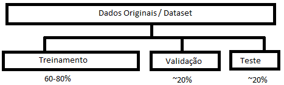

### Matriz de Confusão
Como (avaliar uma matris de confusão) usa:   
~~~
Métricas para avaliar o modelo:

Acurácia: são os verdadeiros (isso vendo na diagonal)
    exemplo: 65% de acertos [Tabela dos gatos]

Precisão: dentre todas as classificações da classe Possitivo, quantas estão certas. (isso la linha de cima, Atual)
    exemplo: ~70% de precisão

Recall: dentre todas as situações  de Classe possitivo com o valor esperado(atual), quantas estão corretas. ( Soma dos 11-01 e assim dividindo-os e )
    exemplo: 50% recall

F1-Score: Média armonica entre precisão e recall.
    exemplo: 58% de F1-Score

conta:  F1=2 * precisão*recall
               precisão+recall
~~~

## Técnicas-Treinamento

    

~~~
Split data - dividir os dados

➞ Conjunto de dados
    ↪ dataset

    ↪ Dados de Treinamento
        ↪ ajustar/treinar modelo

    ↪ Dados de Validação
        ↪ validação do treino
    
    ↪ Dados de teste
        ↪ Testa o modelo treinado

Validação é durante o treino
~~~

### Engenharia de Recursos - Transformação

~~~
Textinho  que vou pegar
~~~

### Seleção de Recursos - Limpeza

~~~
Exemplo: prever quando um cliente fará um novo pedido.
~~~

### Passo a Passo de que se faz

 - Preparação de dados
    - seleção de recursos
    - engenharia de recursos
    - Split Data
 - Treinar Modelo
 - Avaliar modelo
    - Matriz de confusão (Classificação)
    - erro quadrático médio (regressão)

## Modelos não Supervisionados

~~~
➞ Agrupamento/Clustering
    ↪ agrupa os semelhantes

➞ Aprendizado por reforço
    ↪ Rotular (tag's) as imagens
    ↪ ensinar as coisas para a ia saber identificar as coisas
~~~