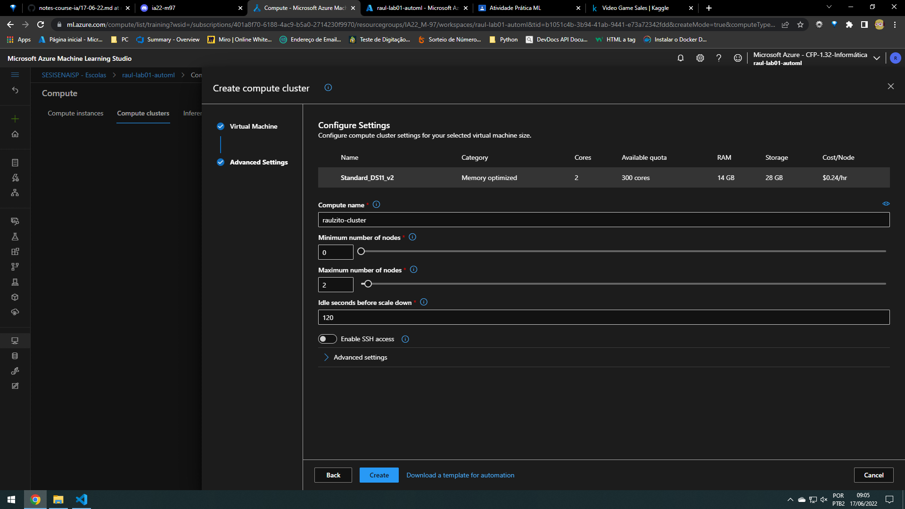
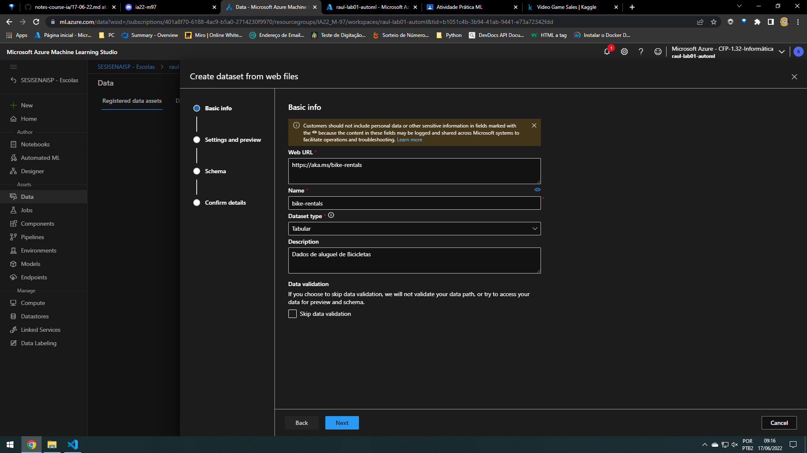
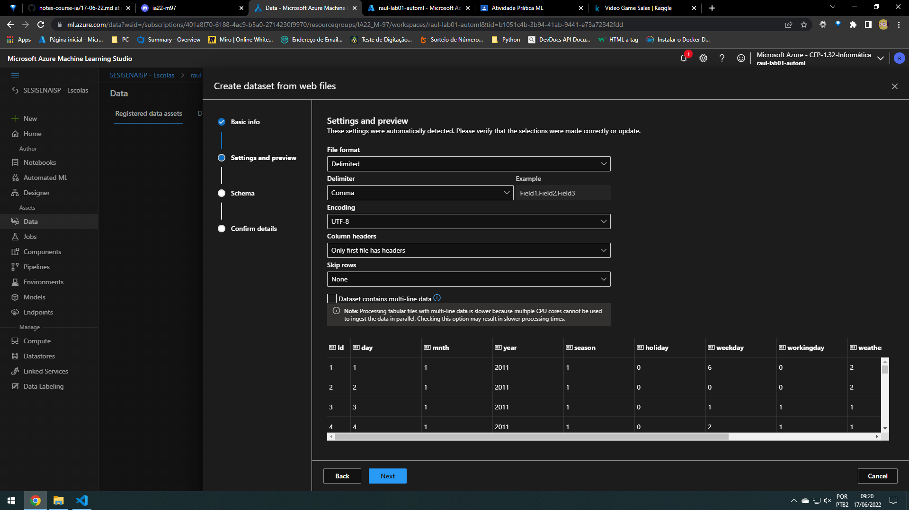
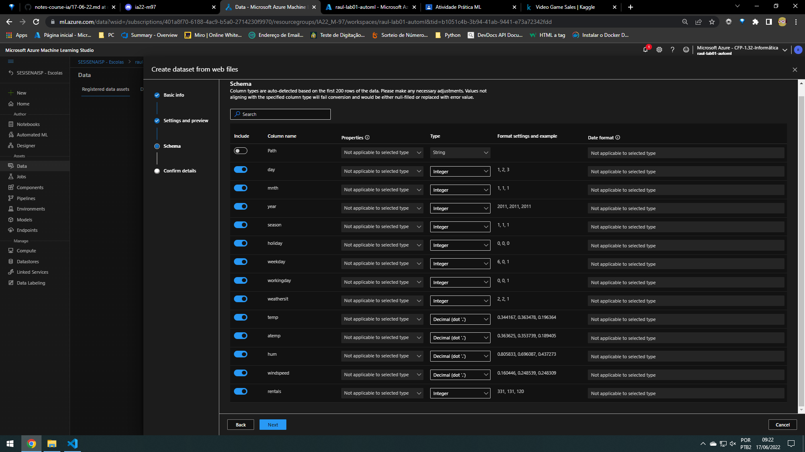
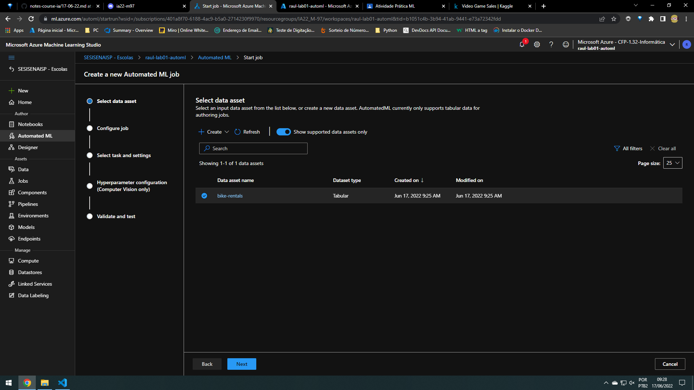
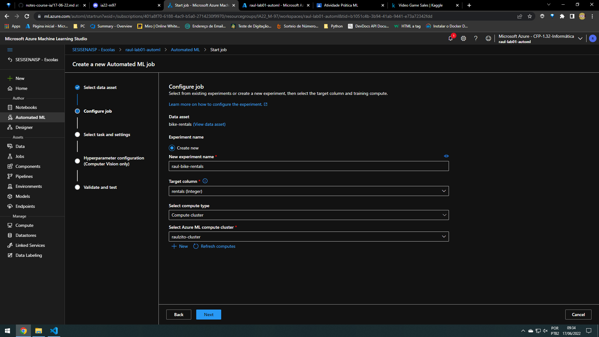
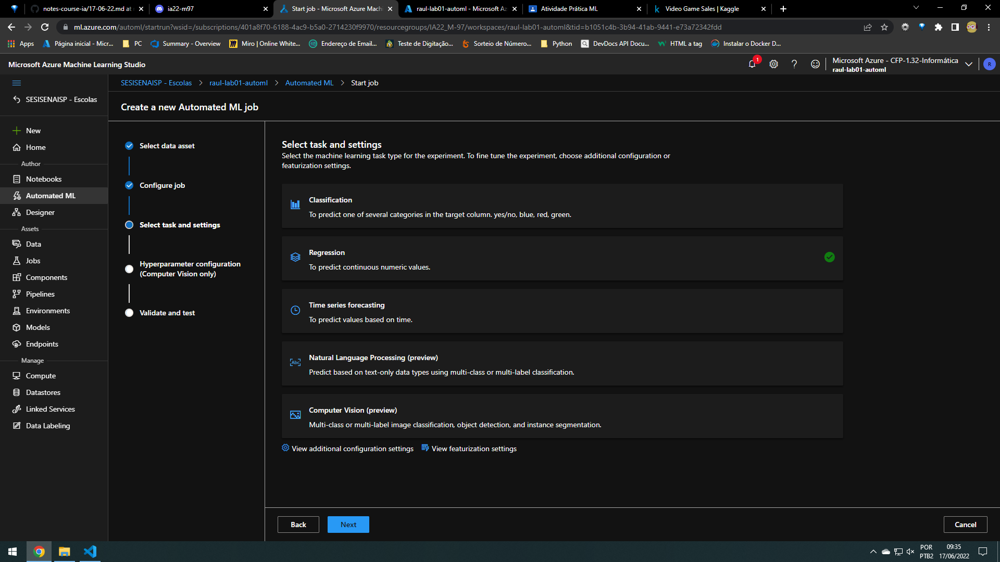
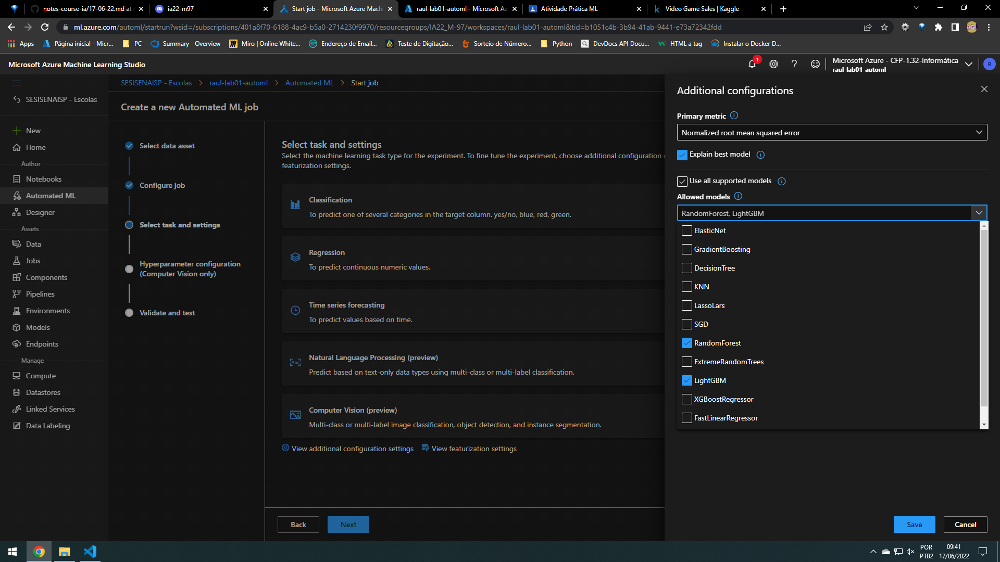

## Azure Machine Learning

~~~
Padrões:
    Básico:
        Nome do workspace:  [NOME]-lab01-automl
~~~

~~~
    Crie um -> Azure Machine Learning
    Procure a ML
        Iniciar o Estúdio
            Cancelar (pesquisa)
~~~

Tour: 
~~~
    Authoring
        Crie, treine, avalie e implante modelos de aprendizado de máquina usando uma ferramenta de autoria.
            Notebooks
            Automated ML
            Designer
    Assets
        Prepare seus dados, execute e monitore seus trabalhos, visualize e implante modelos, gerencie endpoints em tempo real e de pipeline.
            Data
            Jobs
            Components
            Pipelines
            Environments
            Models
            Endpoints
    Management
        Visualize e gerencie recursos para seu workspace.
            Compute
            DataStores
            Linked Services
            Data Labeling
~~~

## 1º Cluster

Criar um cluster de cálculo

~~~
Management > compute
Vá ára a Guia
    Compute Cluster
        new
~~~

~~~
Next
~~~

~~~
Padrões:
    Básico:
        Compute name:  [NOME]-cluster
    NOMES SÃO UNICOS
~~~

~~~
Create
~~~

### Explorar dados

~~~
Vá para Assets > Data
    Create > From Web Files
~~~

### Basic info

### Settings and preview

### Schema

### Confirm detalis

Esta tudo padrão, com somnente um alateração

## Author > Automated ML

~~~
New Automated ML job > Treina o modelo

Select Dataset
~~~

### Select data asset

### Configure job

~~~
Padrões:
    Básico:
        New experiment name:  [NOME]-bike-rentals
        NOMES SÃO UNICOS

        Target column é a coluna que precisamos descobrir
~~~

### Select task and settings

- View additional configuration settings   
  

### 