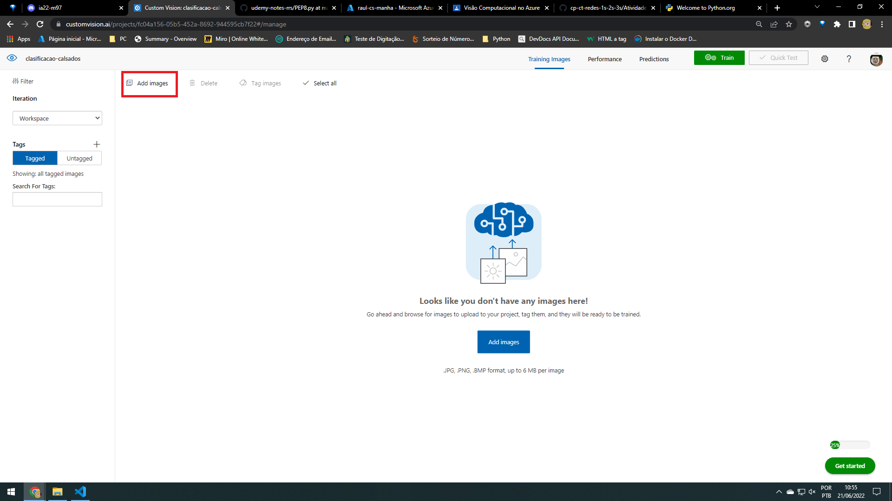
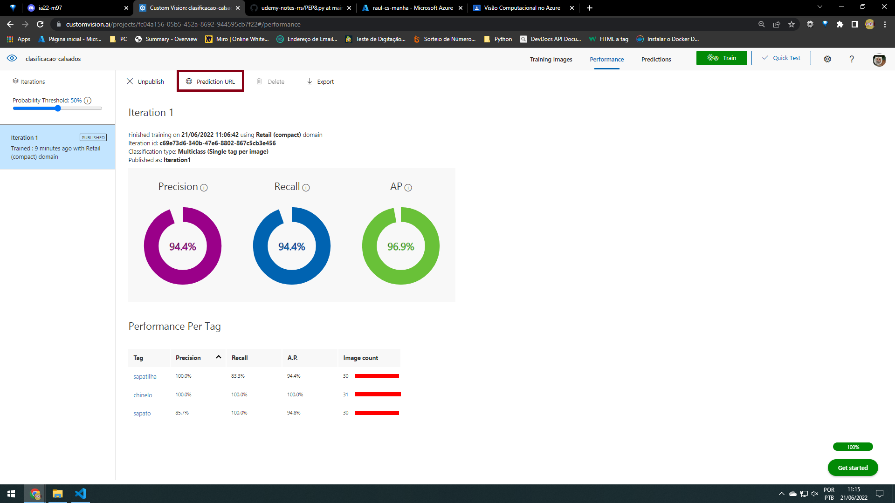

## Classificação de Objetos

Trabalho com erro primeiro.
~~~
Erro absoluto médio (MAE) é de regresão
~~~

Engenharia de recursos - é transformar um dados em novos recursos     

## Dectação ML

~~~
Identificação facial - identifica rostos (imagina gogle fotos que sapara os rostos)

Verificação - comparar dois rostos |  Duas imagens de um rosto pertencem à mesma pessoa?

semelhança - comparação entre as semelhancias entre outras pessoas |  Essa pessoa se parece com outras pessoas?

agrupamento - Todos os rostos pertencem um ao grupo |  Todos os rostos pertencem um ao outro?

identificação -  Quem é essa pessoa neste grupo de pessoas?
~~~

~~~
Digitalizar = OCR (reconhecimento óptico de caracteres) = extrair texto de imagem 
~~~ 

## Lab de Classificação

vai ser feito uma class por visão   
 - 1 crie um serviço cognitivo na azure;
 
 - 2 <a href="https://www.customvision.ai/">custom-vision</a> entre nesse link para entar no terminal do custom vision
 
 
 
 
 
 - terminal onde vai ser colocado as imagens
  

 - colocar as imagens
 
 
 
 
 - Faça o mesmo para todas as imagens, Depois de adicionar as imagens treine o modelo
  
  

 - Espere treinar
 
 

 - Para testar faça assim e cole o link da imagem ali ou suba a imagem
 
 
 
 - Publicar
 
 

 - P/ pegar o endpoint p/ uso vá aqui
 
 

---