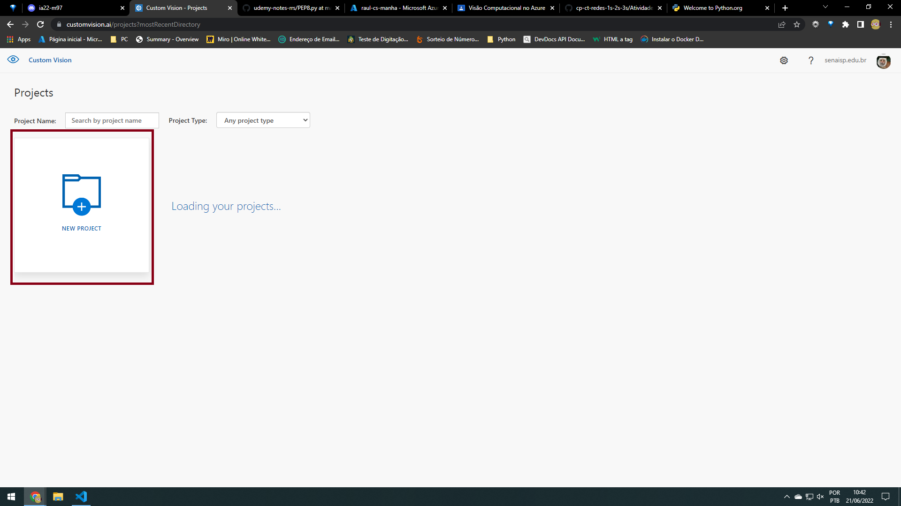
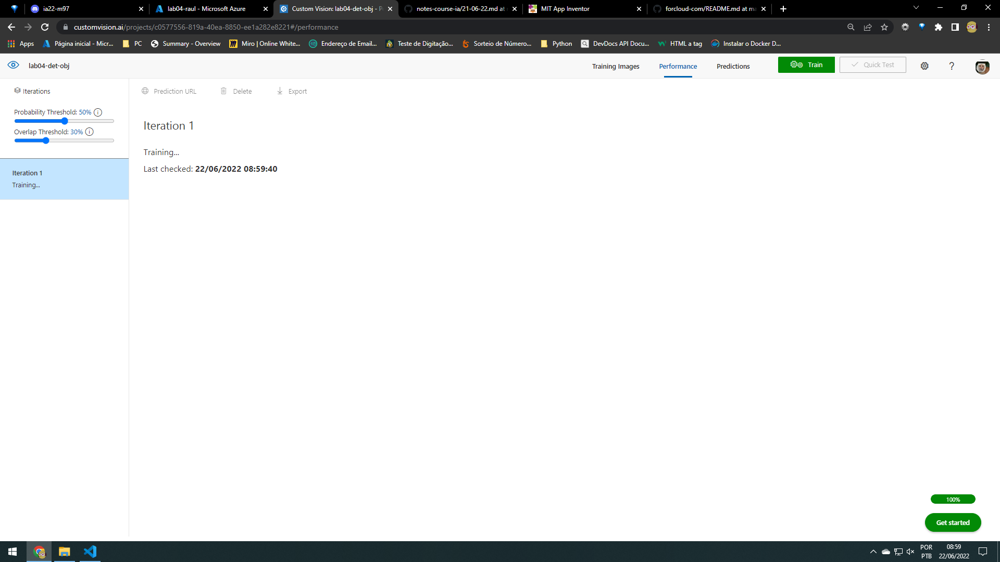
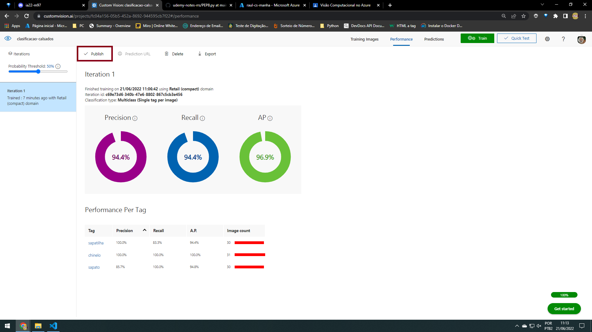
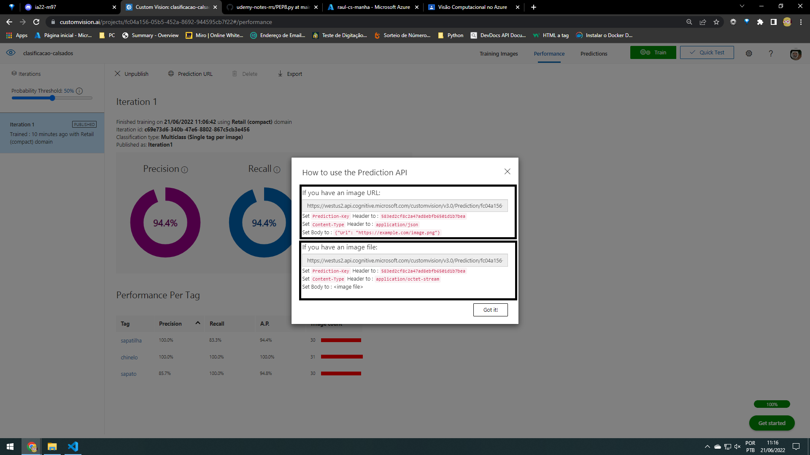

## Lab de Detectação de objetos

## Criar um serviço cognitivo  
vai ser feito a detectação de objetos
- 1 crie um serviço cognitivo na azure;
 
 - 2 <a href="https://www.customvision.ai/">custom-vision</a> entre nesse link para entar no terminal do custom vision
  
 
 
 

 - colocar as imagens
 
 
 

 - Adicionar todas as tags
 
 faça com o resto das fotos
 
 
 

  - Espere treinar
  
  

  - Para testar faça assim e cole o link da imagem ali ou suba a imagem
 
 

 - Publicar <Imagens dia 21-06-22>
 
 

 - P/ pegar o endpoint p/ uso vá aqui <Imagens dia 21-06-22>
 
 