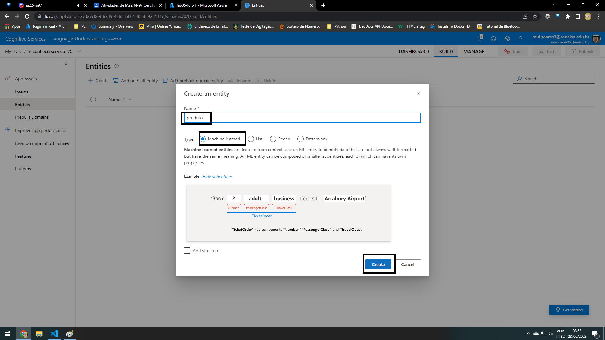
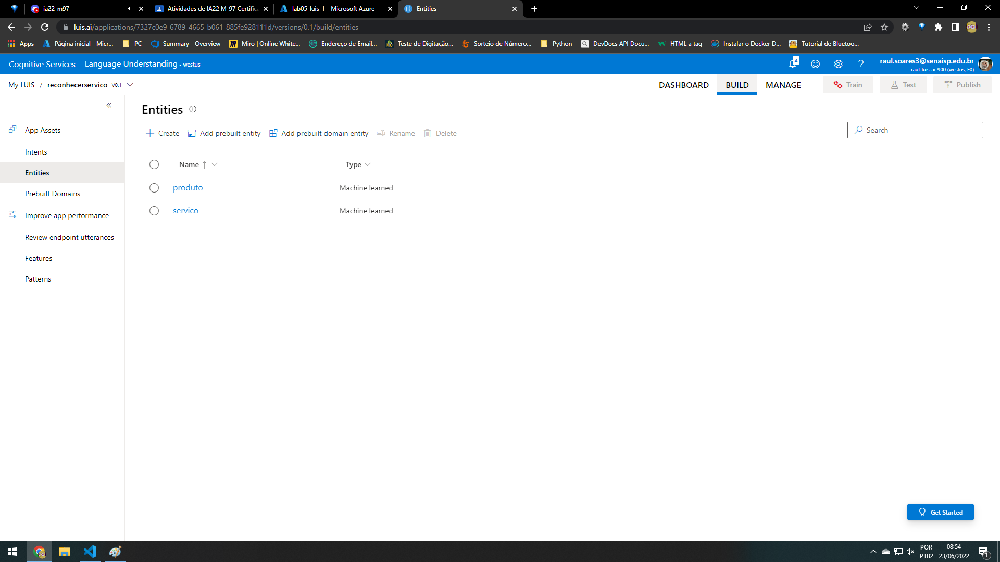
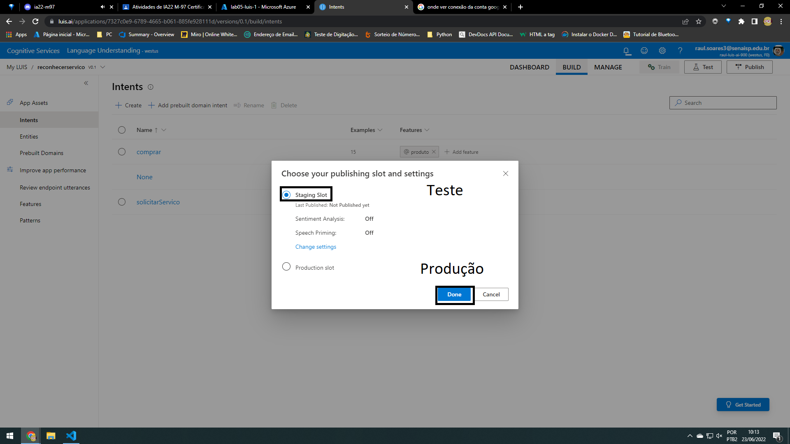

## Revisão de processamento de linguagm natural 

~~~
LUIS é o reconhecimento de linguagem natural
    Linguagem Coloquial
    Compreensão da Linguagem
~~~

## Speech services (LUIS)

Language Understanding Intelligent Service (LUIS)

### Text Analitcs

~~~
➞ Reconhecimento amplo de entidade
    ↪ Identifique conceitos importantes no texto, incluindo frases-chave e entidades nomeadas, como pessoas, eventos e organizações. [Extrai resumos importantes]
    
➞ Reconhecimento de Entidade
    ↪ Ou seja extrai entidades específicas.
~~~

### Serviços de fala

~~~
Reconhecimento - fala para texto
Sintese - texto para fala
~~~

## Luis

Utterance  - Enunciadios, são frases que enviamos para o LUIS ele chama de encunciados.  

entre no site do luis, selecione a assinatura.

 
 
 

 - Criar app dentro do Luis
  
  

 - Adicone intenções que o luis vai identificar <Intents - painel>
  
  

 - Adicione entidades  <Entities - painel>
  
  
  

 - Adicone uma feture nas intents
   
   
   
  - Adicone frases para fazer relações.
   
   

  - Publcar
   
   