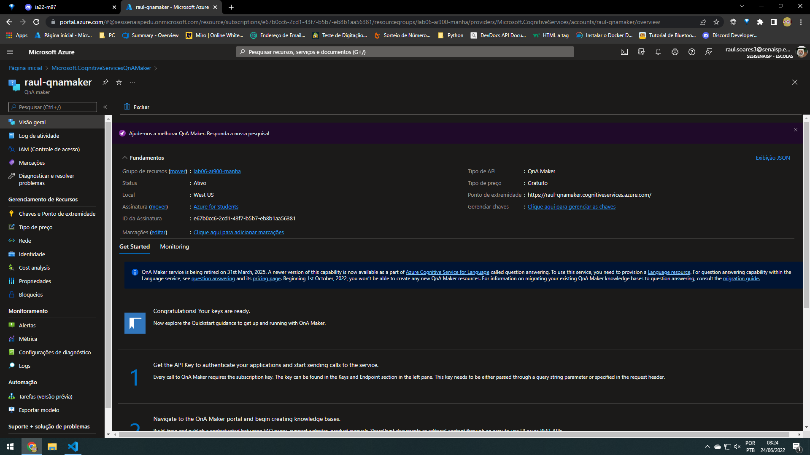
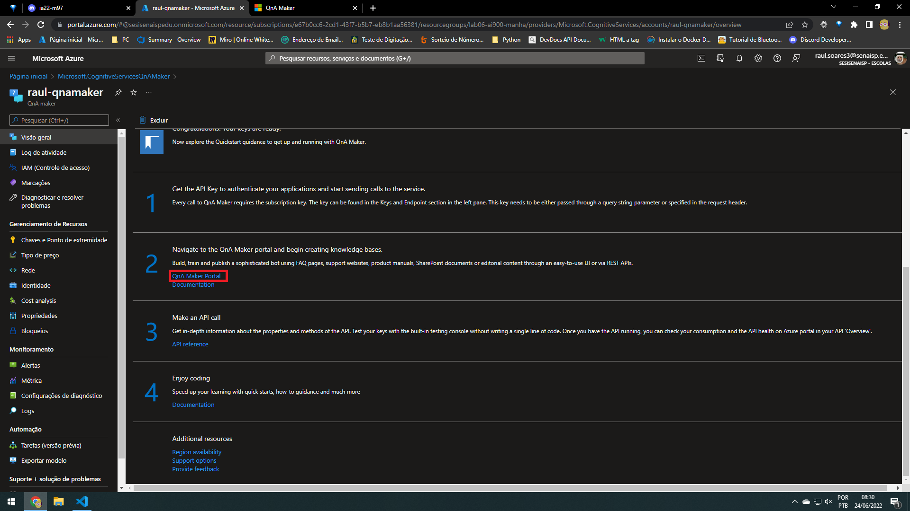
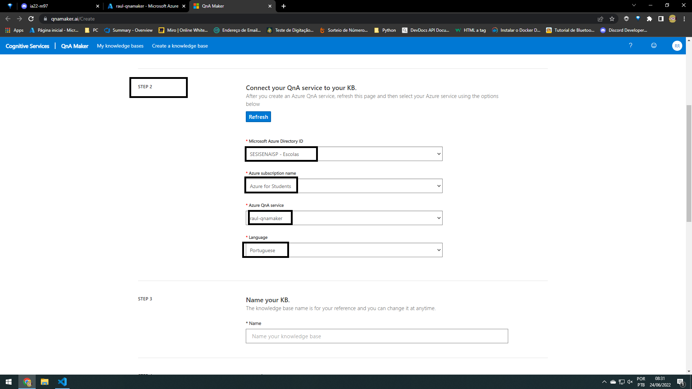
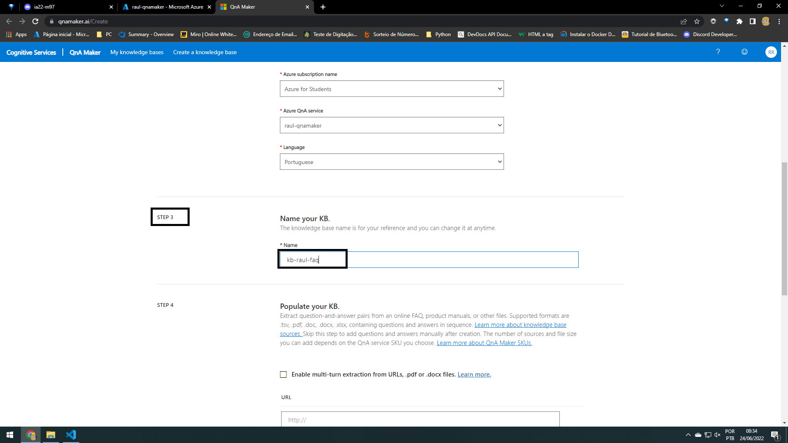
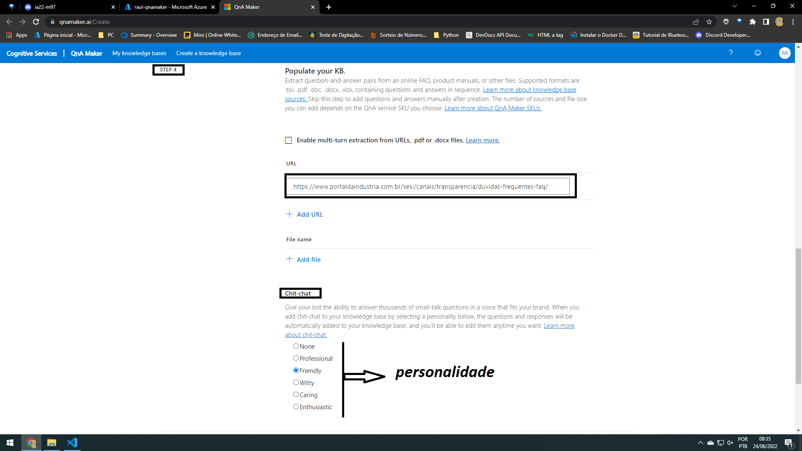
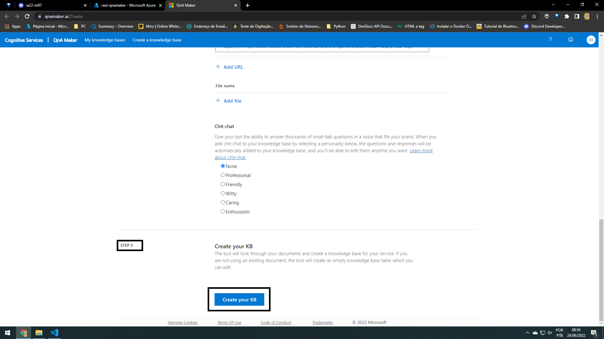
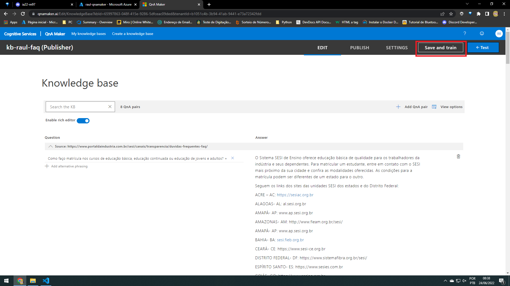
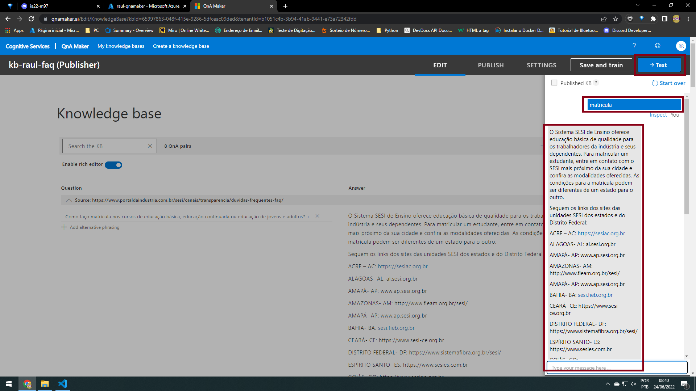
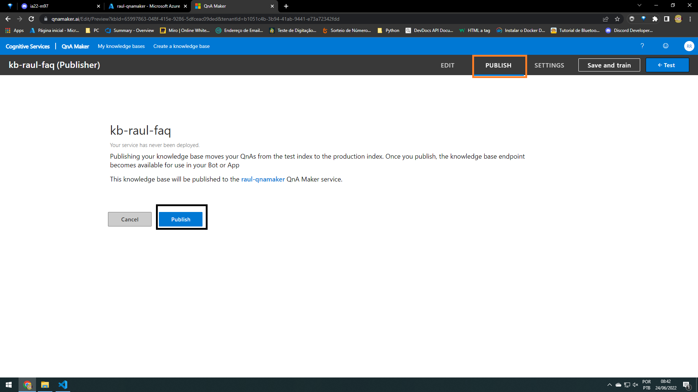

 ↪

## Hoje é QNA Maker

## Criar o serviço do QnA Maker
vai ser feito o FAQ
~~~
➞ Tem como importa de um arquivo PDF, da internet ou até mesmo de um documento word

➞ FAQ é relacionada ao QnA MAKER
~~~

- 1 crie um serviço do QnA MAKER;
 

- 2 <a href="https://www.qnamaker.ai/Create">QnA Maker</a> entre nesse link para entar no terminal do QnA Maker
 
 
 
 
 

 - 3 Treinar 
 
 

 - 4 Publicar
 

